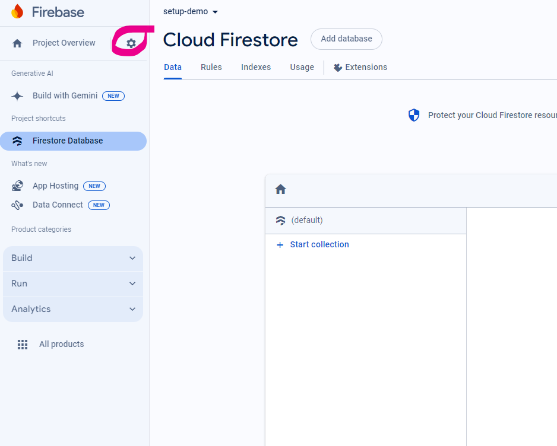
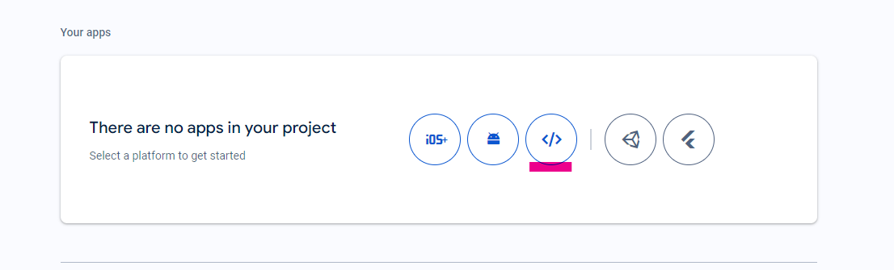
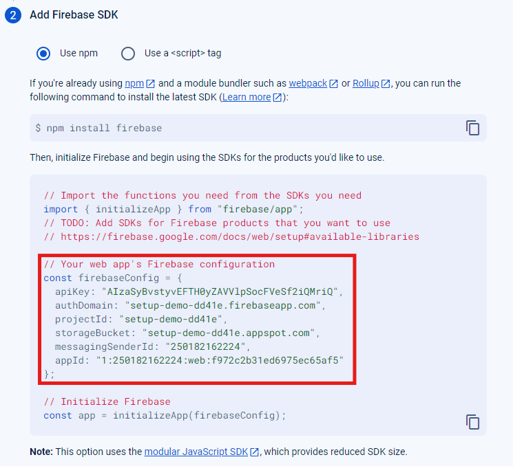
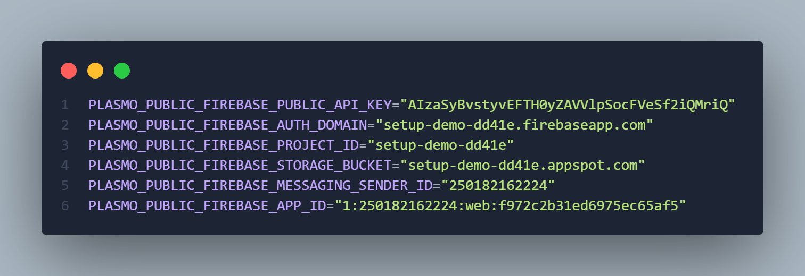

# Setup

## Firestore Database

- Sign in to your firebase [console](https://console.firebase.google.com/).
- Create Firebase projects
- Once project is created click on **Cloud Firestore** in your app dashboard.
- Click on Create database
- Select location (if allowed) and in Secure rules section select **Start in test mode**.
- Now go to the **Project settings** from **Project Overview** side menu.
  
- In **Your apps** section click on add a web
  
- Provide App nickname, leave checkbox unchecked and click on Register app.
- For **Add Firebase SDK** leave it as it is.
  - Copy the firebase config and store it somewhere for now.
    
- Click continue to console

[Reference](https://firebase.google.com/docs/firestore/quickstart)

## Environment Setup

- Create `.env` file and used contents from `.env.example` file.
- Use the firebase config values we store earlier in `.env` file (keys are already in order)
  - `.env` file should look like following after this step.
    
- `pnpm install`
- `pnpm build`
- The build output will be inside `build/chrome-mv3-prod` folder.
- Open chrome and go to `chrome://extension`
- Toggle Developer mode on on the top right of the page.
- Click on **Load unpacked** button and navigate to the extension folder.
- The extension should be installed.

## Using the extension

- Open [daraz](https://www.daraz.com.np/) site
- You should see the extension icon on the right middle page.
- Visit to any products page and click on it to start scrapping.
- Once done, the data and scrapping history should be populated in firestore database.

## Database schema

The database schema consists of two collections: `data` and `history`. 

`data` stores the scrapped data and has properties `title`, `url`, `description`, `price` and `image`.

`history` stores the scrapping history and has properties `timestamp`, `title`, `url`